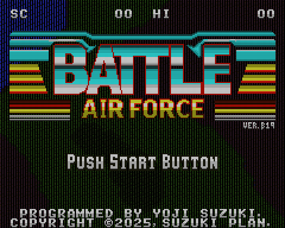

# Welcome to SUZUKI PLAN

SUZUKI PLAN is a common name for Yoji Suzuki (individual) to carry out doujin activities, and is not a corporation.

## Apps

### Battle AirForce (Steam for Windows/Linux/macOS)

[https://store.steampowered.com/app/3476490/Battle_AirForce/](https://store.steampowered.com/app/3476490/Battle_AirForce/)

### Battle Marine (Steam for Windows/Linux/macOS)

[https://store.steampowered.com/app/2824990/Battle_Marine/](https://store.steampowered.com/app/2824990/Battle_Marine/)

### 東方BGM on VGS (iOS)

[https://apps.apple.com/jp/app/id680248037](https://apps.apple.com/jp/app/id680248037)

### 東方BGM on VGS (Android)

[https://play.google.com/store/apps/details?id=com.suzukiplan.TOHOVGS](https://play.google.com/store/apps/details?id=com.suzukiplan.TOHOVGS)

### 東方BGM on SCC (Android)

[https://play.google.com/store/apps/details?id=com.suzukiplan.tohoscc](https://play.google.com/store/apps/details?id=com.suzukiplan.tohoscc)

## Major Repositories

### VGS

- [Video Game System - Zero](https://github.com/suzukiplan/vgszero)
- [Z80 Assembler for VGS-Zero](https://github.com/suzukiplan/vgsasm)
- [GBA SDK for port from VGS-Zero](https://github.com/suzukiplan/gbasdk)
- [Video Game System SDK - Pico](https://github.com/suzukiplan/vgssdk-pico)
- [VGS BGM Decoder](https://github.com/suzukiplan/vgs-bgm-decoder)
- [VGS MML Compiler](https://github.com/suzukiplan/vgs-mml-compiler)
- [東方BGM on VGS for コマンドライン](https://github.com/suzukiplan/tohovgs-cli)
- [東方BGM on VGS version 4 for Android](https://github.com/suzukiplan/tohovgs4-android)
- [東方BGM on VGS version 4 for iOS](https://github.com/suzukiplan/tohovgs4-ios)
- [東方BGM on VGS version 5 for RP2040](https://github.com/suzukiplan/tohovgs-pico) (東方VGS実機版)

### Emulators

- [SUZUKI PLAN - Z80 Emulator](https://github.com/suzukiplan/z80)
- [Z80 Console](https://github.com/suzukiplan/z80-console)
- [FAIRY COMPUTER SYSTEM 80](https://github.com/suzukiplan/fcs80)
- [micro MSX2+](https://github.com/suzukiplan/micro-msx2p)

### MSX Tools

- [MSX Disk Manager for CLI](https://github.com/suzukiplan/msx-disk-manager-cli)

### Books

- [note: 東方BGM on VGS（実機版）](https://note.com/suzukiplan/n/n8c494f9b7113)
- [GitHub: 6502マシン語ゲームプログラミング](https://github.com/suzukiplan/mgp-fc)
- [Qiita: MSXのアプリ開発環境を構築する方法（macOS向け）](https://qiita.com/suzukiplan/items/b369d3f9b41be55b247e)
- [Qiita: 要件定義入門（原題: Firebase Hosting + GitHub で音楽配信システムを作ってみた）](https://qiita.com/suzukiplan/items/8ba8f135da8a7749fb0a)
- [Qiita: ほぼ最強の8bitゲーム機「ゲームギア」プログラミング入門](https://qiita.com/suzukiplan/items/4388874cacef18873db2)
- [Qiita: Z80+C言語で16ビット機級の本格的なゲームが創れるゲーム機（VGS-Zero）を作ってみた](https://qiita.com/suzukiplan/items/8a740b593816ef9ef565)
- [Qiita: 実戦派!! Z80アセンブリ言語入門](https://qiita.com/suzukiplan/items/343a93e9f30e51af110e)

## Third Party Articles

- [東方BGM on VGS (Appliv)](https://app-liv.jp/849916/)
- [Battle Marine (Bangers in the Bezel)](https://steamcommunity.com/groups/bezelbangers/curation/app/2824990/)

## Stats

